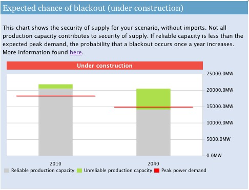
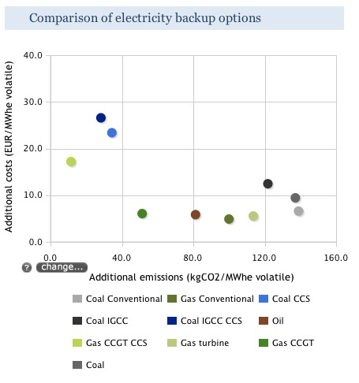

# Electricity backup

This page documents information about the "flexibility of electricity production" project. This project was done in cooperation with GasTerra in the period June 2011 through March 2012. The project consists of two parts: The loss of load probability calculation and the flexibility of electricity backup calculation. In the ETM the calculations are found: [here](http://pro.et-model.com/scenario/supply/electricity_backup/security-of-supply#security-of-supply).

Introduction
------------

The calculations in this part of the ETM were implemented to communicate the limitations of volatile electricity production in contributing to security of supply and the necessity for backup when building scenarios with large shares of technologies such as wind turbines and solar PV panels. The calculation consists of two parts: the security of supply calculation and the flexibility of electricity backup calculation.

The first calculation shows the loss of load probability of a scenario by taking into account the reliability of electricity production and therefore shows whether a scenario has sufficient reliable production capacity (for an explanation of some of the terms used here, see definitions below and the security of supply section).

The flexibility of electricity backup calculation offers a comparison between fossil fuel technologies in terms of their ability to serve as backup for volatile electricity production. The comparison is made by considering only the costs and CO2 emissions exclusive to providing backup for volatile electricity production.

On this page an explanation is given about the project.

Useful definitions
------------------

-   Loss of load probability – The chance that a power generation park is unable to meet the expected demand. In most power systems this value should be very close to 0%. A non-zero value however does not imply that a blackout will occur, since often it is the case that electricity can be imported if it cannot be locally produced.
-   Unreliable electricity production capacity – Capacity that cannot always be counted on due to unpredictability and (unexpected) maintenance requirements. Unreliable capacity includes most volatile electricity production (solar PV and wind) as well as the average expected unavailability of fossil fuel power plants.
-   Reliable electricity production capacity – As opposed to unreliable capacity, reliable capacity is the fraction of the total production capacity that can be deemed reliable. This includes the majority of the fossil fuel production capacity (with exclusion for the unavailability) and some volatile electricity production capacity (depending on the capacity credit).
-   Capacity credit – This is a term used to express a technologies ‘contribution to capacity’. The capacity credit is expressed as a percentage and is the fraction of the capacity that can be relied on. For example: Solar PV panels have no capacity credit since there is not always sun. Fossil fuel power plants on the other hand have a very high capacity credit because these are controlled and are available to produce electricity when needed. Finally, for the Netherlands, wind turbines have a capacity credit of approximately 14-20%. This implies that approximately one-fifth of wind turbine capacity is reliable, which depends on the assumption that the wind turbines are sufficiently dispersed over a large geographic area [(IEA, 2009)](http://refman.et-model.com/publications/1664).
-   Additional capacity – Backup capacity for long periods of no wind/sun.
-   Reserve capacity – Capacity dedicated to dealing with fluctuations due to forecasting errors on short time scales (\<1 hour).

Loss of load
------------

### Introduction

The loss of load probability calculation was deployed in December 2011. The calculation for the Netherlands has been verified by TenneT and the versions for other countries are in a more preliminary phase.

The calculation shows the probability that available electricity production capacity is less than the expected demand. Such a calculation is an important consideration when planning a power system and similar, but more elaborate, versions of this calculation are always conducted by the Transmission System Operators of a country [(TenneT, 2011)](http://www.tennet.org/english/tennet/publications/technical_publications/monitoring_reliability_supply/index.aspx).

With this calculation in the ETM, users can see whether they have a sufficiently reliable electricity production system that can meet the expected demand at all times of the year. This calculation confronts users with the importance of having backup capacity if they build scenarios with significant shares of volatile energy technologies.

### In the ETM

The loss of load dashboard item can be accessed via the flexible dashboard by clicking 'Change' on the bottom right corner of the Energy Transition Model interface. If the calculation is selected, the loss of load probability is seen in the middle of the dashboard. This percentage is the probability that production capacity is less than demand by comparing the peak electricity demand and the installed electricity production capacity. By clicking on the dashboard item reveals a popup showing a chart with three values for both the present and the future year. In the chart the three things shown are:

-   Peak electricity demand - This is the largest power demand expected to occur in a year. In this figure the maximum positive variability of demand is also included, giving an absolute peak.
-   Reliable capacity - The reliable capacity is electricity production capacity that can be counted on at all times and/or periods of the year. Volatile energy technologies such as solar PV and wind turbines have a limited, to zero, contribution to the reliable capacity (often referred to as capacity credit. See below).
-   Unreliable capacity - Unreliable capacity is electricity production capacity that cannot be guaranteed at all times and/or periods of the year. Production by solar PV and wind turbines fall into this category.

The sum of the reliable and unreliable production capacity is equal to the total installed capacity.

If the peak electricity demand is less than the reliable capacity the loss of load probability increases. To decrease the loss of load probability, reliable capacity needs to be installed. Favorable options are technologies such as: gas CCGTs, large CHPs, hydro plants, etc.

### Calculation

Calculating the loss of load probability is done using the following parameters:

-   Total yearly electricity demand in TWh - Taken from the ETM based on user decisions.
-   Load factor of yearly electricity demand as a % - Value of 68% used for the Netherlands [(CIEP, 2011)](http://refman.et-model.com/publications/1666)
-   Unpredictability of electricity demand as a % - Taken as 8%
-   Installed electricity production capacity in MW - Taken from the ETM based on user decisions.
-   Availability of all types of electricity production plants as a % - Value varying between 85-99% depending on the power plant taken from various sources.
-   Capacity credit of volatile energy technologies as a % - For wind turbines 14-20% is used and for solar panels 0% is used.

With the above parameters the calculation is carried out in the ETM assuming that the variability in electricity production and electricity supply are normally distributed. Assuming a normal distribution it is possible to calculate the likelihood that the peak electricity demand is lower than the available electricity production. This is illustrated in the figure at the left. Please note that in the figure the security of supply is shown by the striped region, the loss of load probability is the complement of this.

Flexibility of electricity backup
---------------------------------

### Introduction

The flexibility of electricity backup calculation was completed in March 2012 and will be deployed to the live ETM in July 2012.

The flexibility of electricity backup calculation offers a comparison between fossil fuel technologies in terms of their ability to serve as backup for volatile electricity production. The comparison is made by considering only the costs and CO2 emissions exclusive to providing backup for volatile electricity production.

### In the ETM

The backup for volatile electricity production module is found under the sidebar item “electricity backup” under the tab “supply”. It consists of a scatter plot comparing different electricity backup options based on the additional costs and emissions that would be incurred on top of the costs and emissions of volatile electricity production. Figure 2 shows a screenshot of the scatter plot. For example, based on the figure it is seen that a Gas CCGT plant had additional costs of approximately 5 EUR/MWhe and emissions of 23 kgCO2/MWhe. Some important things to understand about the values expressed in the scatter plot:

-   Everything is expressed per MWhe of the volatile electricity production. For example: an offshore wind turbine has levelised electricity costs of approximately 165 EUR/MWhe, on top of this an additional 5 EUR are required for the costs of the backup when using as Gas CCGT.
-   The additional costs and emissions values are only those costs and emissions associated with the backup. For example: backup reserve capacity does more than only provide reserves, it also provides useful electricity. The costs associated with this useful electricity are disregarded. A Gas CCGT working at optimal efficiency produces electricity at costs of approximately 50 EUR/MWhe. When working to provide backup capacity, the Gas CCGT does not operate optimally and the electricity generation costs increase to 55 EUR/MWhe. Only the difference, 5 EUR/MWhe, is taken into account for the additional costs of backup capacity. This also applies for the CO2 emissions. (note: this 5 EUR/MWhe difference is not the same as the 5 EUR/MWhe that is seen in the chart as more than only reserve costs are taken into account. The first value is in MWhe of the Gas CCGT power plant itself and the value in the chart is in MWhe of the volatile electricity production, that these two are the same is therefore only a coincidence.)

### Calculation

Details about the calculation can be found in the project documentation found [here](http://refman.et-model.com/publications/1705). The details are excluded here because of formatting limitations.

Literature
----------

-   Meray, N., 2011. Wind and Gas: Back-up or Back-out, “That is the Question”.
-   UK Energy Research Center (UKERC), 2006. The Costs and Impacts of Intermittency.
-   Vourinen, A., 2009. Planning of Optimal Power Systems.
-   Strbac, G., et al., 2006. Impact of wind generation on the operation and development of the UK electricity systems

