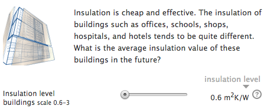
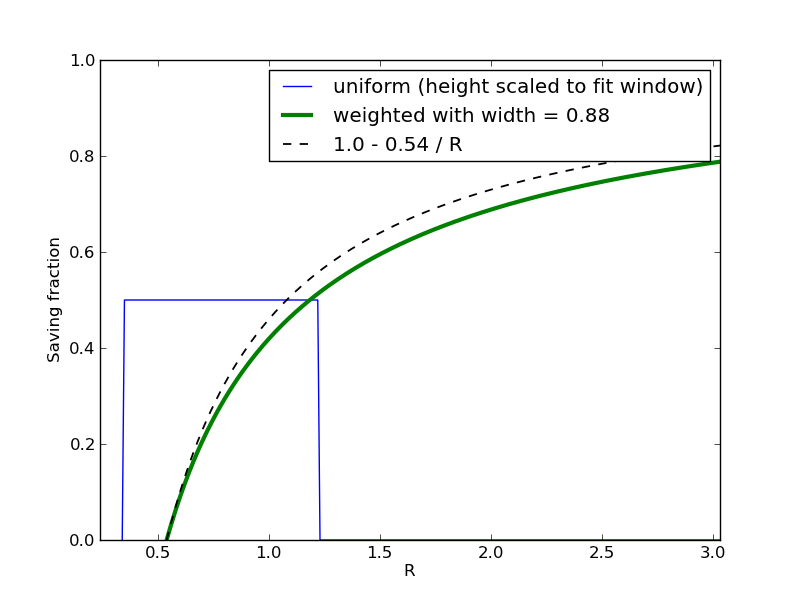
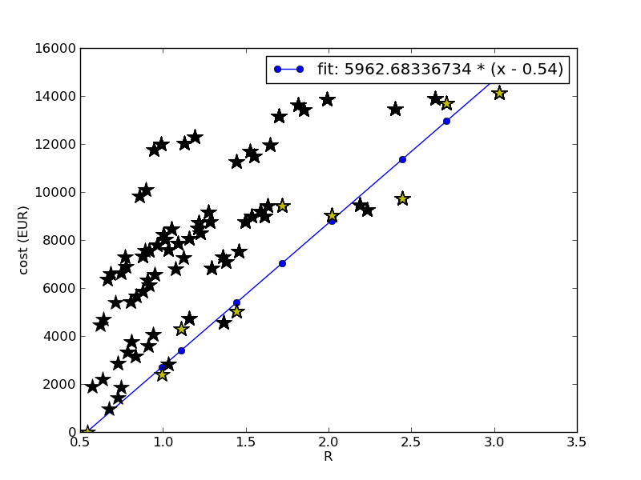

Introduction
------------

Insulation can be used to bring down the amount of heating and cooling we need for our houses to stay comfortable. The ETM allows you to choose insulation levels for old houses, new houses and buildings (in the Commercial and Public Services, shortly CaPS, sector) separately. This page discusses the modeling methods used for the implementation of insulation in the ETM and the data that underlies the modeling.

Research
--------

The data on the current quality of insulation in residences in the Netherlands shows that there is a jump in R-value from residences build before 1992 and residences build after 1991. We, therefore, distinguish between these two populations as 'old' and 'new' residences in the ETM and the remainder of this text. Another observation is that the <strong>distribution</strong> of R-values is roughly flat; all R-values occur equally often. Given these two observations, we have implemented the slider ranges for residences as shown in the image right. A more detailed description of our derivation of slider values is given in the Modeling Section below.

We have based the insulation savings, costs and employment on the following publicly available literature:

-   [AgentschapNL\_201101\_Voorbeeldwoningen bestaande bouw 2011.pdf](http://refman.et-model.com/publications/1819)
-   [Arcadis AgentschapNL\_20130618\_Maatwerkadviw bestaande woningbouw 2013.pdf](http://refman.et-model.com/publications/1817)

and the following websites:

-   [www.wbs-ltd.co.uk](http://www.wbs-ltd.co.uk/wetherby-systems/system-components/insulants/)
-   [www.isobouw.nl](http://www.isobouw.nl/File.aspx?id=2e2903b1-9413-455a-92e5-23446ca2a12b)

Modeling
--------

In this section we describe the modeling methods used for our insulation implementation. We also discuss important simplifications and assumptions.

### R-value

The R-value is a measure for the quality of the insulation of a building (or house). It is **inversely proportional** to the 'leakiness' factor U (Also see [http://en.wikipedia.org/wiki/R-value\_(insulation) Wikipedia](http://en.wikipedia.org/wiki/R-value_(insulation) Wikipedia "wikilink")):

`  R = 1 / U.                                (1)`

To find the R-value of a building, one must consider the insulation values of the components, usually denoted as 'Rc' **and** the relative fraction those components attribute to the total surface area of the building that is in contact with the outside world:

` R = (A_1 / Rc_1 + A_2 / Rc_2 + ... )^-1    (2)`

where the 'A's are the relative surface areas. In our modeling we consider the following relative areas (given in %) for the components of residences and buildings:

|Component|% of area (Residences)|% of area (Buildings)|
|---------|----------------------|---------------------|
|Walls|27|30|
|Roof|35|29|
|Floor|28|29|
|Windows|10|12|

For residences, the relative surface areas given in the table above are a weighted average over all residences reported by [AgentschapNL\_2011](http://refman.et-model.com/publications/1819).

For buildings (in the public and commercial sector), such detailed data is not available and we have combined the total reported area of buildings with the number of buildings to derive a typical building.

#### Lower limits for sliders

The current Rc-values for the various components in residence have been taken from [AgentschapNL\_2011](http://refman.et-model.com/publications/1819) as well, yielding effective R-values for the old and new residences using Equation 2. These R-values are the lower limits for the sliders in Figure 1. For buildings, no quantitative data on insulation level exists. We have used a qualitative survey of 10000 buildings where the classes "Bad", "Reasonable" and "Good" have been used to describe the insulation level and translated those statements to values using example-residences from [AgentschapNL\_2011](http://refman.et-model.com/publications/1819), see Figure 2. Obviously, the approach for buildings is very rough but we feel that the available data does not allow for more accuracy here.

#### Upper limits for sliders

To derive the upper limits for buildings and residences, we have applied the most effective insulation options that do not significantly impact the dimensions of the building (not thick layers inside the living space or outside of the walls) as they are not applicable in most buildings / residences. For residences (old and new) the upper limit is found to be 3.0. For buildings 2.7.

We note that it is possible to build residences with higher R-values than 3.0. The reason that the slider values are limited as described above is threefold:

1.  When quoting R-values of residences and buildings, people often leave the Rc-value of windows out of the equation. The reason is that Rc-values of windows are "'much"' lower than those of the rest of the components of a building and therefore dominate the effective R-value given by Equation 2. We, however, include the Rc-values of windows in our calculation of the R-value, leading to lower upper limits.
2.  We use a **population** of buildings with a spread equal to the current observed range in R-values of residences and buildings. The effective R-value of such a population is dominated by the worst insulated buildings which tends to reduce the upper limit even more.
3.  We have not been able to find quality data for the costs and employment figures of techniques used in advanced (energy neutral / passive) buildings. We have therefore not included such buildings in our analysis.

### Heat demand reduction

The (fractional) savings in heating (cooling works analogously) demand due to insulation (heating\_demand\_new) can expressed as a fraction of the old heating demand (heating\_demand\_old):

`  heating_demand_saving = 1.0 - heating_demand_new / heating_demand_old     (3)`

where heating\_demand\_old has a constant value for the start scenario of the ETM. The heating demand is **inversely proportional** to the R-value of the house. So

`  heating_demand_new / heating_demand_old = R_old / R_new.                  (4)`

To calculate the savings of a population of buildings /residences, we have integrated the heating demand saving over a flat distribution . In Figure 3, the (vertically scaled) distribution for old houses is shown in blue.

In order to see how the savings depend on the effective R-value, we have **shifted** the distribution to higher R-values. The result of this the green curve in Figure 3. As a reference, the dashed line shows the result if the width of the distribution would be taken to be infinitely narrow (one type of house only). Because the real population (with non-zero spread) is dominated by the very worst insulation values, the population actually has a bigger savings potential: improving all houses in the population with, say 0.5 m\^2 K/W, would improve the total savings more than for the reference curve. Results for new residences and (CaPS) buildings are similar.

### Cost and Employment

 for the population of insulation scenarios for old residences.")

To determine the cost and employment figures (man hours) of insulation, we have used data from [Arcadis 2013](http://refman.et-model.com/publications/1817). For the components listed in the table above, we have taken two options, a cheap and an expensive one. Generally, the more expensive options have a higher R-value as well. We have created **all possible combinations of insulation** (including **not** applying an option) for the components of the residences and buildings to generate a **population** of insulation scenarios. The lower limit in cost and man hours is set by the (trivial case) of a residence without extra insulation; the current state of affairs. The upper limit of cost is set by applying all expensive options to the residence. All scenarios and their costs in EURO are shown Figure 4.

Given the population of insulation scenarios, we have looked at the cheapest scenario for a given range in R-value. In other words, we ask "If I want to have my house insulated to 1.8 \< R \< 2.0, what is the cheapest option. These scenarios are the stars with a yellow heart in Figure 4. To derive a function for the costs of insulation as a function of R-value (slider setting) we have fitted a line through the yellow stars.

The approach for employment data (man hours) is similar (see Figure 5).
