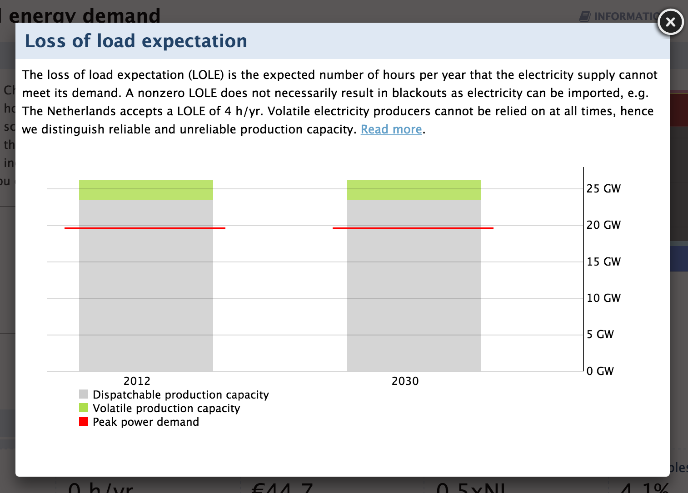
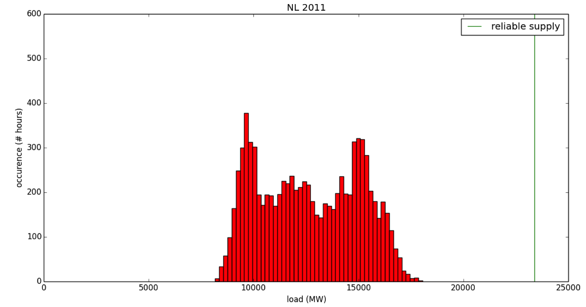

# Loss of load expectation

Introduction
------------

The loss of load calculation received a major update in January 2014. The calculation returns the loss of load expectation (LOLE), i.e. the expected number of hours per year that a country's electricity production cannot meet its demand. The results is displayed in a dashboard item that can be accessed by clicking on *change* in the dashboard and selecting *Loss of load expectation*. Like all dashboard items, the loss of load expectation is shown for the end year of the scenario.

The LOLE is an important consideration when planning a power system and similar, but more elaborate, versions of this calculation are conducted by the Transmission System Operators of a country (see e.g. [TenneT, 2012](http://www.tennet.eu/nl/nl/over-tennet/nieuws-pers-publicaties/publicaties/technische-publicaties/rapport-monitoring-leveringszekerheid-2011-2027.html)). A nonzero LOLE does not necessarily result in blackouts as electricity can extracted from storage or imported from neighbouring countries. TenneT accepts a LOLE of 4 hours/year.

By displaying the LOLE in the ETM, users can see whether they have sufficiently reliable electricity production that can meet the expected demand at all times of the year. This calculation confronts users with the importance of having backup capacity if they build scenarios with significant shares of volatile energy technologies.

In the ETM
----------

The loss of load dashboard item can be accessed via the flexible dashboard by clicking **change** on the bottom right corner of the Energy Transition Model interface. If this item is selected, the loss of load expectation is seen in the middle of the dashboard. The displayed number is the expected number of hours per year that the country's electricity production capacity cannot meet its demand. Clicking on the dashboard item reveals a popup showing a chart with the following items for both the present and the future year:

- Peak electricity demand - This is the largest power demand expected to occur in a year.
- Reliable production capacity - The reliable capacity is electricity production capacity that can be counted on at all times during the year. Volatile energy technologies such as solar PV and wind turbines have a limited, to zero, contribution to the reliable capacity, often referred to as their capacity credit (see below).
- Unreliable capacity - Unreliable capacity is electricity production capacity that cannot be guaranteed at all times. All solar PV electricity production capacity and a large fraction of the wind electricity production capacity falls into this category.

The sum of the reliable and unreliable production capacity is equal to the total installed capacity.

If the peak electricity demand is less than the reliable capacity the loss of load expectation increases. To decrease the loss of load expectation, reliable capacity needs to be installed or the demand needs to be reduced.

Calculation
-----------

Several methods exist for calculating the loss of load expectation. Since we like to keep the calculation time of the Energy Transition Model low, we opted for a basic approach, for which we use the following data:

- Country specific hourly load profiles (see the ETDataset documentation for the sources of these load profiles)
- Total yearly electricity demand - taken from the ETM based on user decisions
- Installed electricity production capacity for all electricity producers - taken from the ETM based on user decisions
- Availability of all electricity producers - taken from the ETM, several sources
- Capacity credit of all electricity producers - taken from the ETM, several sources

In short, the calculation consists of the following steps.

- Scale the demand profile
- Calculate reliable production capacity
- Compare the demand profile and the reliable production capacity and determine LOLE

These three steps are explained in detail below.

### Scale the demand profile

One of the main assumptions in our approach to calculating the LOLE is that the shape of the hourly load profiles stays the same while going from the present year to the future year. Hourly load profiles for the present year are readily available from multiple sources (see ETDataset for these sources). Many parameters affect the shape of the hourly load profiles, e.g. the demand profiles for specific technologies and human behaviour. As we do not have data on this yet, we decided to leave the shape of the load profiles the same. We do, however, scale the load profile such that the area underneath it is equal to the total yearly electricity demand.

### Calculate reliable production capacity

Not all electricity production can be relied on at all times. For instance, solar PV do not produce any electricity at night meaning that they do not contribute to the reliable production capacity. In the ETM, we model this by assigning a capacity credit to every electricity producers (see below for details). In addition to the capacity credit every electricity producers has an availability assigned to, which describes what fraction of the time the electricity producer is available and not down due to, e.g. maintanence. The reliable production capacity of an electricity producer is defined as `installed_capacity * availability * capacity_credit`. The total reliable production capacity is simply the sum of the reliable production capacity for all electricity producers

### determine LOLE

The hourly load profile consists of 8760 data points, representing the average hourly load for each hour of the year. We compare each of these 8760 hours to the reliable production capacity that was calculated above, and determine at how many of these hours the load exceeds the reliable production capacity. This number of hours is defined as the LOLE. The figure below shows a graphical representation of the LOLE calculation. For clarity, the load profile hase been represented as a histogram (red). The reliable production capacity is shown as a green line. In this particular case, the LOLE is equal to zero as none of the events in the histogram are to the right of the green line.

Capacity credit
---------------

The capacity credit of an electricity producer is a measure for ability of this producer to replace convetional electricity production or, in other words, a measure for the producers contribution to the reliable production capacity. A solar PV installation for example has a capacity credit of 0% because it is certain that this installation will not produce any electricity at night. Conventional or thermal electricity producers and technologies such as pumped storage hydro power on the other hand have a capacity credit of 100%. The output of these technologies is controlled and hence their contribution to reliable capacity is 100%.

The capacity credit of wind turbines is strongly depended on the installed wind capacity. Several studies have been performed to the exact shape of this dependence (see e.g. [(IEA, 2009)](http://refman.et-model.com/publications/1664)). In the ETM, we use the results from [(Wilton, 2013)](http://refman.et-model.com/publications/1847), page 40 and 41. These numbers have been calculated for The Netherlands, but, due to the lack of others sources, are used for all other countries as well. The model developed by Wilton is only valid for installed wind capacities of 379 MW or more. For lower capacities, the capacity credit calculated by the model becomes unphysically high. To correct this behaviour, we assume that capacity credit stays the same for installed capacities of 379 MW and lower. The capacity credit of wind varies from 32% to 4% for the range of installed wind capacity that can be achieved in the ETM (see figure below).

All electricity producers have an attribute `variability`. For consistency, we defined `capacity_credit = 1 - variability`.

Discussion
----------

The following aspects of the current LOLE implementation can be improved on and should be subject of further study.

- The wind capacity credit function should be researched for Germany and Europe.
- The shape of the hourly load profile should be depended on the technologies that have been installed in the ETM. This is a major effort as hourly demand and production profiles need to be researched for all converters in the ETM.
