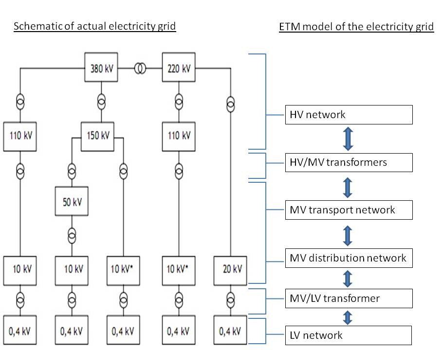
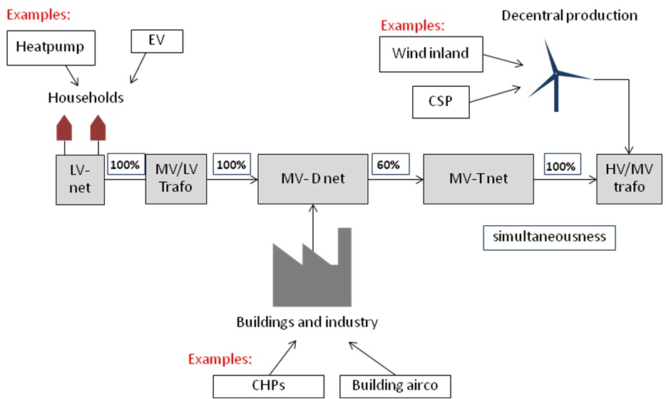
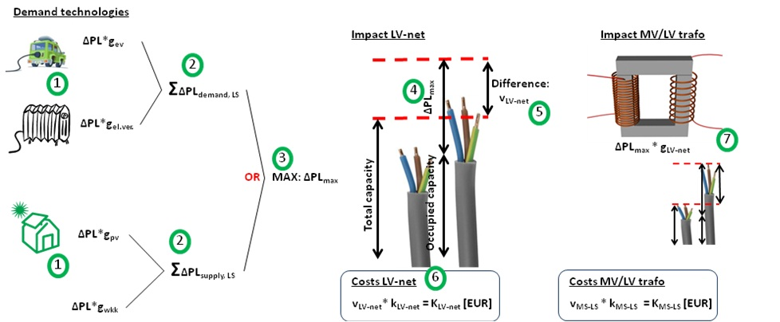

# Network impact calculation

The network impact calculation is a module that currently only works for the Dutch version of the ETM. The calculation determines the investment required in the electricity grid depending on the choices made by the users. For example, in a scenario with a large share of electric heaters the capacity of the current electricity grid is not sufficient to meet all demand.

The results of the Network Impact calculation are two graphs on the front end of the model: ‘Required additional infrastructure investments’ and ‘Annual infrastructure costs’. The first graph shows the total additional investment required in the electricity grid for certain scenarios and the second shows these costs in annual costs including operation and maintenance costs and interest.

Network calculation definitions
-------------------------------

To better understand the network calculation a few definitions are required:

**Peak load**

Peak load refers to the maximum load that occurs in a given period of time. In the ETM four periods of time are considered: summer day, summer evening, winter day, and winter evening. Depending on the technology and how it is used, the peak load values vary for each period. *Example*: Solar panels will have the largest peak load during the early afternoon of a summer day. During a summer evening or a winter day solar panels might still produce electricity however the peak load for these time periods will be lower. For network impact calculations peak loads are of interest because cables and transformers have a maximum capacity and as long as the maximum load is lower than the available capacity no network expansion is required (i.e. the amount of energy flow over a period of time is irrelevant).

**Peak load delta**

The change in the peak load is called the peak load delta. The network impact calculation is a comparison calculation; the required network expansion is determined by how much the peak load changes with respect to the current situation.

**(Network) Impact**

The required network expansion is determined by finding the required network capacity (MVA) necessary to meet the future scenario. A higher impact therefore means a larger capacity of cables and transformers is required in a given scenario. In the ETM impact is often expressed in Euro by multiplying the required capacity by the cost coefficients (EUR/MVA).

**Capacity**

Cables and transformers have a maximum capacity; they can only carry so much electricity at any instant. Capacity is expressed in Volt-Ampere, the units for complex power. In the ETM Mega Volt-Amperes (MVA) are often used. For the ETM it is sufficient to consider the complex power (MVA) and the real power (MW) although in reality the complex power is slightly larger than the real power.

**Simultaneousness**

Each technology has a certain peak load; however these peak loads do not occur at the same time. Therefore to describe the overlap between peak loads the term simultaneousness is used. Simultaneousness is the probability that two peaks fall in the same time. Simultaneousness has a maximum value of 100%. Example: Electric vehicles have a simultaneousness of 19% in the summer and winter evenings periods. This is because not everyone will charge their electric vehicle at the same time. Heat pumps on the other hand have a simultaneousness of 100%, this is because it is certain that on a very cold day all the heat pumps will be on at the same time.

Network calculation basics
--------------------------

Unlike most calculations in the ETM, this one involves load on the grid, not energy flow through the grid. For this reason, all calculations are performed in the query layer, not in the graph. To calculate the required investment the ETM uses a model of the Dutch electricity grid consisting of six levels, a simplified version of the actual electricity grid.

The six levels that are defined are: Low voltage network (LV network), Medium/Low voltage transformer (MV/LV transformer), Medium voltage distribution network (MV distribution network or MV-D network), Medium voltage transport network (MV transport network or MV-T network), High/Medium voltage transformer (HV/MV transformer), and High voltage network (HV network).

The following figure shows a schematic of the electricity grid and the model considered by the ETM. 

The most important difference between the actual grid and the model used in the ETM is that the ETM model consists of only one component per level (i.e. instead of taking into account the thousands of cables and transformers that compose the actual grid, the ETM views these as a single cable or transformer for each level.)

To calculate the network impact both a bottom up and a top down calculation are used. The bottom up calculation is used to calculate the impact on the LV network up to the HV/MV transformer and the top down calculation is used for the impact on the HV network.

Network impact bottom up calculation
------------------------------------

The bottom up calculation is used to calculate the impact of a user's scenario on the LV network up to the HV/MV transformer level.

The approach assumes that the networks are connected in linear fashion and that any electricity produced at the lowest level flows up through the higher levels. This implies that for each level it is necessary to consider what the impact is at the current level as well as what the impact is of the flow of electricity from lower levels. This concept is depicted in the following figure:

To calculate the impact at a given level it is necessary to know what technologies are found at that level. The impact is determined by calculating the peak load deltas of relevant technologies and determining whether the network needs to be expanded or not. The following schematic and the explanation following shows how the calculation works:

1. The technologies that affect the electricity grid (such as heat pumps, solar panels, electric vehicles, etc.) are split into two categories: supply and demand technologies. For each technology the delta peak load of a single unit is calculated and multiplied by the simultaneousness.

2. The peak loads for the supply and demand technologies are summed up.

3. The peak load of the supply and demand is compared and the maximum delta peak load is found.

4. For each level of the electricity network a total capacity and an occupied capacity are defined. The max delta peak load is added on top of the currently occupied capacity.

5. If the occupied capacity plus the delta peak load capacity exceed the total capacity then investments are required in the electricity grid.

6. The required investment is calculated by multiplying the difference in capacity by the network expansion coefficients.

7. To calculate the impact at the next level the impact of the previous level is taken into account along with the simultaneousness.

Network top down calculation
----------------------------

The second part of the network impact calculation is the top down calculation used to calculate the impact on the HV network. Since central production technologies such as coal and nuclear power plants are so large it is almost always necessary to invest in the HV network. Therefore, for the top down calculation a different approach is used.

The following rules of thumb provided by TenneT are used to determine the required investment in the HV network based on the number of megawatts of installed capacity.

- On the HV network, 1600MW can be added without requiring additional investments.

- If the newly installed capacity is higher than 1600MW, then the costs for network expansion are 20% of the installed capacity. For example: If 2000MW is installed, the network costs are 400MEuro.

- Additionally, if the total decentral capacity is larger than 30GW the costs are 25% instead 20%.

- For import and export the available capacity is 4200MW. If the total import or export is greater than this value, the extra required capacity is determined by considering interconnectors as power plants with a capacity of 400MW and a capacity factor of 62%.
